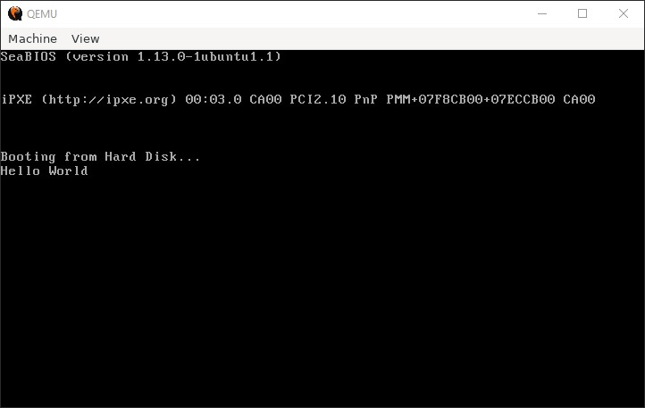
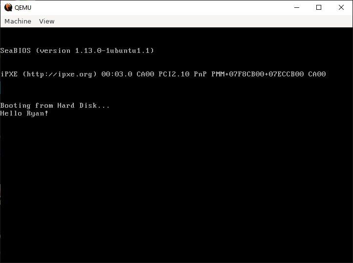

# Hello World Boot Loader
by [Daniel Rowell Faulkner](mailto:daniel.faulkner@cwcom.net)
* [Tutorial](http://www.osdever.net/tutorials/view/hello-world-boot-loader)

This tutorial is a simple walk through a hello world boot loader. This like any other boot loader has to obey a few rules.

## Terms used:
  **BIOS** - A chunk of code which is builtin. This tests that the hardware is present and has some functions builtin that can be called using interrupts

  **Interrupts** - Is a call to a builtin function/procedure

  **Hexadecimal** - 16base numbering system.
> Refer to hex numbers in Asm by putting a 'h' after or a 0x before.

  **Decimal** - Normal numbering system you have most likely known for years. 10 base

## Rules:
1. It MUST be 512bytes long!
This is because the BIOS will automaticly load the first sector of the boot disk into the memory. (Boot disk is set in the BIOS, the normal setup is to have it boot from the floppy drive and failing that the hard drive).
2. It MUST end with the bootloader signature, '55 AA'

### Where is the boot loader loaded to in memory?
In hexadecimal it is loaded to `7C00`.
In decimal it is loaded to 31744 (I think) Why is this? Well the computer has a number of special things stored in the early memory which as you go on you will find out about and learn about. Personally I only have a vague idea myself as to what lives between 0 and 4864.

## INT 0x10:
INT 0x10 is the BIOS video interrupt. All the display related calls (in theory) are made through this interrupt.
So how do you use it? Well you have to have certain values in certain registers to use it.

  **AH** - 0x0E AL - ASCII character to display

  **BH** - Page number (For most of our work this will remain 0x00)

  **BL** - Text attribute (For most of our work this will remain 0x07) change the value for different colour etc.

Then you call the interrupt once the registers are in place.

## Installing a boot loader:
Well the boot loaders in this document are on the whole ok to copy and try for yourself. (Except the first example) And I don't accept any responsibility if it all goes horribly wrong. (though I hhope it doesn't and it shouldn't)

Also I advise against installing the boot loader over your current hard drives boot loader (if you want to load your normal any time soon lol)

So what do you need? An x86 CPU based computer. (AMD/Intel basicly, most home PC's) 286/286/486...
And a floppy disk to install the boot sector on.
And NASM to compile the source code.
(NASM can be downloaded for free from there site, you should find it on all major search engines)
An other alternative is BOCHS which is a computer enumerator, but I'll explain that in a different tutorial.

Step 1. Copy/Write the boot sector to a standard text file. (.txt/.asm/.s/etc ending doesn't matter)
Step 2. Type at the prompt: 'NASM filename.txt' this should output a compiled file
Step 3. Check the compiled file is 512 bytes big exactly. (Won't make the PC go bang if it isn't but it won't work and it saves you a reboot if you get it right first time)
Step 4. Install the boot loader to the first sector of the disk. (Varies per OS)
Insert blank floppy: (formatted, and reformat before trying to write to it)

### DOS:
```sh
DEBUG file 
  - w 100 0 0 1
  - q
```

### Linux:
```sh
# (Insert a floppy but don't mount it)
$ dd if=Bootloader bs=512 of=/dev/fd0
```

Step 5. Reboot leaving the floppy in the drive. (And set the BIOS if needed to boot from 'A' drive first)

Assembly language examples:

## Nothing boot loader:
(Do NOT copy and run)
```asm
; Start matter
[BITS 16]       ; Tells the compiler to make this into 16bit code generation
		            ;  code
[ORG 0x7C00]    ; Origin, tells the compiler where the code is going to be
		            ;  in memory after it has been loaded. (hex number)

; End matter
times 510-($-$$) db 0   ; Fill the rest of the sector with zero's
dw 0xAA55               ; Add the boot loader signature to the end
```

Ok so what does this example do? Well it does nothing! At least nothing worth mentioning about. Let me explain, a lot of it you should be able to understand from the comments I've put in to the example. The end matter is a little confussing though.
_times 510-($-$$) db 0_
This reads: Times 510-(Start of this Instruction - Start of program) with 0's
  $ stands for start of the instruction
  $$ stands for start of the program

db stands for define byte (I think) - a byte is 8 bits, a bit can be a 0 or a 1.

### dw 0xAA55
For some reason the signature has to be written this way round!
This fills the last to bytes of the boot loader with 55AA (this is a hex number)
Without this signature the BIOS won't recognise this as a bootable disk!

I suggest that you don't try this boot loader as it will possibly leave the boot loader and try to run instructions left in the memory.

## Never ending loop boot sector:
```asm
[BITS 16]     ; 16 bit code
[ORG 0x7C00]  ; Code origin set to 7C00

main:         ; Main code label (Not really needed now but will be later)
jmp $         ; Jump to the start of the instruction (never ending loop)
	            ; An alternative would be 'jmp main' that would have the exact same
	            ;  effect.

; End matter
times 510-($-$$) db 0
dw 0xAA55
```

So now what does this do?
This puts the boot loader into a continuous loop.
Is this help full? Not at all
Will you see anything on the screen? Nope (only BIOS stuff)

This boot loader you can try making and running yourself, won't be very impressive or anything to write home about but no harm can come from it (in theory)

I think this example is pretty self explanitory, so onwards to the actual boot loader.

## Character on the screen boot loader:
```asm
[BITS 16]       ; 16 bit code generation
[ORG 0x7C00]    ; ORGin location is 7C00

;Main program
main:           ; Main program label

mov ah,0x0E     ; This number is the number of the function in the BIOS to run.
		            ;  This function is put character on screen function
mov bh,0x00     ; Page number (I'm not 100% sure of this myself but it is best
		            ;  to leave it as zero for most of the work we will be doing)
mov bl,0x07     ; Text attribute (Controls the background and foreground colour
		            ;  and possibly some other options)
		            ;  07 = White text, black background.
		            ; (Feel free to play with this value as it shouldn't harm 
		            ;  anything)
mov al,65       ; This should (in theory) put a ASCII value into al to be 
		            ;  displayed. (This is not the normal way to do this)
int 0x10        ; Call the BIOS video interrupt.

jmp $           ; Put it into a coninuous loop to stop it running off into
		            ;  the memory running any junk it may find there.

; End matter
times 510-($-$$) db 0   ; Fill the rest of the sector with zeros
dw 0xAA55               ; Boot signature
```

This code should be self explanitory again. What does it do? Well now you will see a character appear on the screen!

But this isn't exactly useful as you would be coding for hours on end with an ASCII code typed in for each character and a new call to the interrupt each time. So hence we move on to the next section.

### Run it with `qemu`
```sh
$ nasm -o boot.o boot1.asm
$ ll ./boot.o 
-rw-r--r-- 1 ryan ryan 512 Apr  5 20:59 ../boot.o

$ qemu-system-i386 -drive format=raw,file=boot.o
```

Output:


## Storing data:
If you have used assembly before you will be used to text/code and data sections. Well in the boot loader we don't have those.

So where do we put the data?
Well we find some place that won't be run as part of the program and put the data there. (and procedures)
This is either at the start of the boot loader with a jmp instruction used to skip them when the boot loader starts.
Or at the end where the boot loader never gets to.
(The choice is up to you, but I advise the end as special tables go at the start if you ever get that far in boot loader work)

```asm
[BITS 16]       ; 16 bit code generation
[ORG 0x7C00]	  ; Origin of the program. (Start position)

; Main program
main:           ; Put a label defining the start of the main program

 call PutChar   ; Run the procedure

jmp $           ; Put the program into a never ending loop

; Everything here is out of the main program
; Procedures

PutChar:                ; Label to call procedure
 mov ah,0x0E		        ; Put char function number (Teletype)
 mov bh,0x00		        ; Page number (Ignore for now)
 mov bl,0x07		        ; Normal attribute
 mov al,65		          ; ASCII character code
 int 0x10		            ; Run interrupt
 ret			              ; Return to main program

; This data is never run, not even as a procedure
; Data

TestHugeNum dd 0x00     ; This can be a huge number (1 double word)
			                  ;  Upto ffffffff hex
TestLargeNum dw 0x00    ; This can be a nice large number (1 word)
			                  ;  Upto ffff hex
TestSmallNum db 0x00    ; This can be a small number (1 byte)
			                  ;  Upto ff hex

TestString db 'Test String',13,10,0         ; This is a string (Can be quite long)

; End matter
times 510-($-$$) db 0   ; Zero's for the rest of the sector
dw 0xAA55		            ; Bootloader signature
```

This boot sector should be safe to copy and run also.
What does it do? The exact same as before except I have put some values into memory, and put the code that puts a character on the screen into a procedure.

The main thing that will look unusual is the line: _TestString db 'Test String',13,10,0_

How come it is only a byte (db)?
Well it isn't, but TestString only stores the memory location not the data it self. And the memory location of the string can be stored in a byte.

Whats with the numbers at the end?
  13 - ASCII for Character Return
  10 - ASCII for New Line
(Character Return and New Line together makes the next text start on the next line)
  0 - Does nothing but will be used later as a marker for the end of the string

The rest of the code you should recognise or understand from the comments.

## Displaying the whole string:
```asm
[BITS 16]       ; 16 bit code generation
[ORG 0x7C00]    ; Origin location

; Main program
main:           ; Label for the start of the main program

 mov ax,0x0000  ; Setup the Data Segment register
		            ; Location of data is DS:Offset
 mov ds,ax      ; This can not be loaded directly it has to be in two steps.
		            ; 'mov ds, 0x0000' will NOT work due to limitations on the CPU

 mov si, HelloWorld     ; Load the string into position for the procedure.
 call PutStr    ; Call/start the procedure

jmp $           ; Never ending loop

; Procedures
PutStr:         ; Procedure label/start
 ; Set up the registers for the interrupt call
 mov ah,0x0E    ; The function to display a chacter (teletype)
 mov bh,0x00    ; Page number
 mov bl,0x07    ; Normal text attribute

.nextchar       ; Internal label (needed to loop round for the next character)
 lodsb          ; I think of this as LOaD String Block 
		            ; (Not sure if thats the real meaning though)
		            ; Loads [SI] into AL and increases SI by one
 ; Check for end of string '0' 
 or al,al       ; Sets the zero flag if al = 0 
		            ; (OR outputs 0's where there is a zero bit in the register)
 jz .return     ; If the zero flag has been set go to the end of the procedure.
		            ; Zero flag gets set when an instruction returns 0 as the answer.
 int 0x10       ; Run the BIOS video interrupt 
 jmp .nextchar  ; Loop back round tothe top
.return         ; Label at the end to jump to when complete
 ret            ; Return to main program

; Data

HelloWorld db 'Hello World',13,10,0

; End Matter
times 510-($-$$) db 0	; Fill the rest with zeros
dw 0xAA55		; Boot loader signature
```

Ok now this will put 'Hello World' on the screen. Thats right if you haev been following this tutorial you have just done it! (Yes you may now celebrate)

### Run it with `qemu`
```sh
$ nasm -o boot.o boot2.asm
$ qemu-system-i386 -drive format=raw,file=boot.o
```

Output:




Disassembled of `boot1.asm` (0x1D - 0x27 is 'Hello World'):

```asm
00000000  B80000            mov ax,0x0          ; start at 0x7C00
00000003  8ED8              mov ds,ax
00000005  BE1D7C            mov si,0x7c1d
00000008  E80200            call 0xd
0000000B  EBFE              jmp short 0xb
0000000D  B40E              mov ah,0xe
0000000F  B700              mov bh,0x0
00000011  B307              mov bl,0x7
00000013  AC                lodsb
00000014  08C0              or al,al
00000016  7404              jz 0x1c
00000018  CD10              int 0x10
0000001A  EBF7              jmp short 0x13
0000001C  C3                ret
0000001D  48                dec ax
0000001E  656C              gs insb
00000020  6C                insb
00000021  6F                outsw
00000022  20576F            and [bx+0x6f],dl
00000025  726C              jc 0x93
00000027  640D0A00          fs or ax,0xa
0000002B  0000              add [bx+si],al

;...

000001FB  0000              add [bx+si],al
000001FD  0055AA            add [di-0x56],dl

```

The last bit was a bit of a jump with loops and things there. So if you want to go back and look at that last section again, please do, you need to be able to understand this before moving on.


# Bootloader with GNU Assembler (GAS)

```asm
/* Bootloader with GAS assembler */
.code16
.org 0

.text

.global _start
_start:
    cli

    /* segment setup */
    mov %cs, %ax
    mov %ax, %ds
    mov %ax, %es
    mov %ax, %fs
    mov %ax, %gs
    mov %ax, %ss

    /* place stack pointer in middle of free memory area */
    movw $0x3000, %sp

    /* save drive number to read kernel later */
    mov %dl, drive_num

    sti

    /* should print Hello Ryan! */
    movw $welcome_str, %si
    call print


_loop:
    jmp _loop


/* prints string in %ds:si */
print:
    xorb %bh, %bh
    movb $0x0E, %ah

    lodsb

    /* NULL check */
    cmpb $0, %al
    je 1f

    /* print %al to screen */
    int $0x10
    jmp print

1:  ret

welcome_str:
    .asciz "Hello Ryan!\n"

/* SAVED DRIVE NUMBER TO READ FROM */
drive_num:
    .word 0x0000

/* MBR BOOT SIGNATURE */
.fill 510-(.-_start), 1, 0
.word 0xAA55
```

Build it:
```sh
$ as --32 -o boot.o -c boot3.asm 
$ ld -m elf_i386 -o bootsect.bin boot.o -Ttext 0x7C00 --oformat=binary
$ ll bootsect.bin 
-rwxr-xr-x 1 ryan ryan 512 Apr  5 23:03 bootsect.bin*
$ qemu-system-i386 -drive format=raw,file=bootsect.bin
```

Output:



Disassembled of `boot3.asm` (0x2B - 0x35 is 'Hello Ryan!'):

```asm
00000000  FA                cli
00000001  8CC8              mov ax,cs
00000003  8ED8              mov ds,ax
00000005  8EC0              mov es,ax
00000007  8EE0              mov fs,ax
00000009  8EE8              mov gs,ax
0000000B  8ED0              mov ss,ax
0000000D  BC0030            mov sp,0x3000
00000010  8816387C          mov [0x7c38],dl
00000014  FB                sti
00000015  BE2B7C            mov si,0x7c2b
00000018  E80200            call 0x1d
0000001B  EBFE              jmp short 0x1b
0000001D  30FF              xor bh,bh
0000001F  B40E              mov ah,0xe
00000021  AC                lodsb
00000022  3C00              cmp al,0x0
00000024  7404              jz 0x2a
00000026  CD10              int 0x10
00000028  EBF3              jmp short 0x1d
0000002A  C3                ret
0000002B  48                dec ax
0000002C  656C              gs insb
0000002E  6C                insb
0000002F  6F                outsw
00000030  205279            and [bp+si+0x79],dl
00000033  61                popa
00000034  6E                outsb
00000035  210A              and [bp+si],cx
00000037  0000              add [bx+si],al

;...

000001FB  0000              add [bx+si],al
000001FD  0055AA            add [di-0x56],dl
```