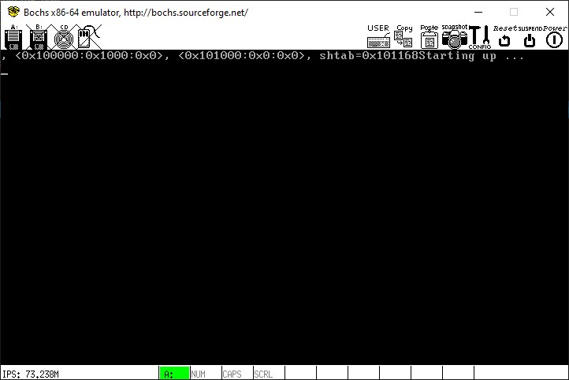
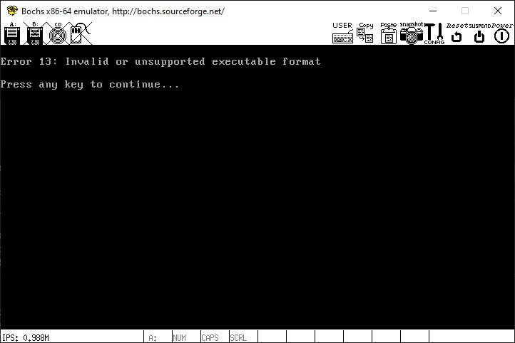
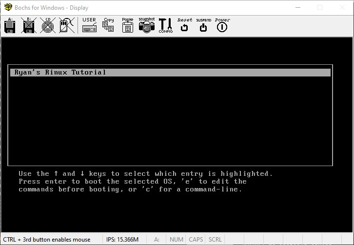

# Genesis

## Build
Install **boch** for the emulator. It's an X11 app.
```sh
$ sudo apt-get install -y bochs bochs-x
```

Then start the win10 XLaunch that accepts all connections.


```sh
~$ cd src
/src$ nasm -f elf32 boot.s
/src$ gcc -nostdlib -nostdinc -fno-builtin -fno-stack-protector -m32 -c -o main.o main.c
/src$ ld -Tlink.ld -m elf_i386 -o kernel boot.o main.o
/src$ ll
total 64
drwxr-xr-x 2 ryan ryan  4096 Apr  3 16:12 ./
drwxr-xr-x 6 ryan ryan  4096 Apr  2 16:51 ../
-rw-r--r-- 1 ryan ryan   441 Apr  3 16:00 Makefile
-rw-r--r-- 1 ryan ryan  1152 Apr  3 16:10 boot.o
-rw-r--r-- 1 ryan ryan  2065 Aug 21  2007 boot.s
-rwxr-xr-x 1 ryan ryan 13792 Apr  3 16:12 kernel*
-rw-r--r-- 1 ryan ryan   659 Aug 21  2007 link.ld
-rw-r--r-- 1 ryan ryan   240 Apr  3 15:48 main.c
-rw-r--r-- 1 ryan ryan  1368 Apr  3 16:11 main.o
/src$ cd ..

$ sudo mkdir /mnt2

$ sudo /sbin/losetup /dev/loop0 floppy.img
$ sudo mount /dev/loop0 /mnt2
$ sudo cp src/kernel /mnt2/kernel
$ ll /mnt2
total 33
drwxr-xr-x  4 root root  1024 Aug 20  2007 ./
drwxr-xr-x 20 root root  4096 Apr  3 15:22 ../
drwxr-xr-x  3 root root  1024 Dec 28  2006 boot/
-rwxr-xr-x  1 root root 13792 Apr  3 16:17 kernel*
drwx------  2 root root 12288 Dec 28  2006 lost+found/

$ sudo umount /dev/loop0
$ sudo bochs -f bochsrc.txt
========================================================================
                       Bochs x86 Emulator 2.6.11
              Built from SVN snapshot on January 5, 2020
                Timestamp: Sun Jan  5 08:36:00 CET 2020
========================================================================
00000000000i[      ] LTDL_LIBRARY_PATH not set. using compile time default '/usr/lib/bochs/plugins'
00000000000i[      ] BXSHARE not set. using compile time default '/usr/share/bochs'
00000000000i[      ] lt_dlhandle is 0x556a01f295e0
00000000000i[PLUGIN] loaded plugin libbx_unmapped.so
00000000000i[      ] lt_dlhandle is 0x556a01f2a600
00000000000i[PLUGIN] loaded plugin libbx_biosdev.so
00000000000i[      ] lt_dlhandle is 0x556a01f2afa0
00000000000i[PLUGIN] loaded plugin libbx_speaker.so
00000000000i[      ] lt_dlhandle is 0x556a01f2cd20
00000000000i[PLUGIN] loaded plugin libbx_extfpuirq.so
00000000000i[      ] lt_dlhandle is 0x556a01f2d4f0
00000000000i[PLUGIN] loaded plugin libbx_parallel.so
00000000000i[      ] lt_dlhandle is 0x556a01f2f150
00000000000i[PLUGIN] loaded plugin libbx_serial.so
00000000000i[      ] lt_dlhandle is 0x556a01f33550
00000000000i[PLUGIN] loaded plugin libbx_gameport.so
00000000000i[      ] lt_dlhandle is 0x556a01f33d80
00000000000i[PLUGIN] loaded plugin libbx_iodebug.so
00000000000i[      ] reading configuration from bochsrc.txt
00000000000i[      ] lt_dlhandle is 0x556a01f34830
00000000000i[PLUGIN] loaded plugin libbx_x.so
00000000000i[      ] installing x module as the Bochs GUI
00000000000i[      ] using log file bochsout.log
ALSA lib confmisc.c:767:(parse_card) cannot find card '0'
ALSA lib conf.c:4732:(_snd_config_evaluate) function snd_func_card_driver returned error: No such file or directory
ALSA lib confmisc.c:392:(snd_func_concat) error evaluating strings
ALSA lib conf.c:4732:(_snd_config_evaluate) function snd_func_concat returned error: No such file or directory
ALSA lib confmisc.c:1246:(snd_func_refer) error evaluating name
ALSA lib conf.c:4732:(_snd_config_evaluate) function snd_func_refer returned error: No such file or directory
ALSA lib conf.c:5220:(snd_config_expand) Evaluate error: No such file or directory
ALSA lib pcm.c:2642:(snd_pcm_open_noupdate) Unknown PCM default
Next at t=0
(0) [0x0000fffffff0] f000:fff0 (unk. ctxt): jmpf 0xf000:e05b          ; ea5be000f0
<bochs:1>
```

The **bochs** stop the _debugger_ because there were some errors. Type in `cont` command to continue.
```sh
<bochs:1> cont
```

It will boot the _kernel_:



Then press `ctrl-C` to stop it:
```sh
^CNext at t=11209119269
(0) [0x000000100027] 0008:0000000000100027 (unk. ctxt): jmp .-2 (0x00100027)      ; ebfe
<bochs:2> quit
(0).[11209119269] [0x000000100027] 0008:0000000000100027 (unk. ctxt): jmp .-2 (0x00100027)      ; ebfe
$ sudo /sbin/losetup -d /dev/loop0
```

If there is any problem with the kernel, it won't start:



Return to the **GRUB** boot loader and try to edit it:



## 2.1. The boot code
OK, It's time for some code! Although the brunt of our kernel will be written in C, there are certain things we just must use assembly for. One of those things is the initial boot code.

Here we go:
```asm
;
; boot.s -- Kernel start location. Also defines multiboot header.
; Based on Bran's kernel development tutorial file start.asm
;

MBOOT_PAGE_ALIGN    equ 1<<0    ; Load kernel and modules on a page boundary
MBOOT_MEM_INFO      equ 1<<1    ; Provide your kernel with memory info
MBOOT_HEADER_MAGIC  equ 0x1BADB002 ; Multiboot Magic value
; NOTE: We do not use MBOOT_AOUT_KLUDGE. It means that GRUB does not
; pass us a symbol table.
MBOOT_HEADER_FLAGS  equ MBOOT_PAGE_ALIGN | MBOOT_MEM_INFO
MBOOT_CHECKSUM      equ -(MBOOT_HEADER_MAGIC + MBOOT_HEADER_FLAGS)


[BITS 32]                       ; All instructions should be 32-bit.

[GLOBAL mboot]                  ; Make 'mboot' accessible from C.
[EXTERN code]                   ; Start of the '.text' section.
[EXTERN bss]                    ; Start of the .bss section.
[EXTERN end]                    ; End of the last loadable section.

mboot:
  dd  MBOOT_HEADER_MAGIC        ; GRUB will search for this value on each
                                ; 4-byte boundary in your kernel file
  dd  MBOOT_HEADER_FLAGS        ; How GRUB should load your file / settings
  dd  MBOOT_CHECKSUM            ; To ensure that the above values are correct
   
  dd  mboot                     ; Location of this descriptor
  dd  code                      ; Start of kernel '.text' (code) section.
  dd  bss                       ; End of kernel '.data' section.
  dd  end                       ; End of kernel.
  dd  start                     ; Kernel entry point (initial EIP).

[GLOBAL start]                  ; Kernel entry point.
[EXTERN main]                   ; This is the entry point of our C code

start:
  push    ebx                   ; Load multiboot header location

  ; Execute the kernel:
  cli                         ; Disable interrupts.
  call main                   ; call our main() function.
  jmp $                       ; Enter an infinite loop, to stop the processor
                              ; executing whatever rubbish is in the memory
                              ; after our kernel!
```

## 2.2. Understanding the boot code
There's actually only a few lines of code in that snippet:
```asm
push ebx
cli
call main
jmp $
```
The rest of it is all to do with the multiboot header.

### 2.2.1. Multiboot
Multiboot is a standard to which GRUB expects a kernel to comply. It is a way for the bootloader to

Know exactly what environment the kernel wants/needs when it boots.
Allow the kernel to query the environment it is in.
So, for example, if your kernel needs to be loaded in a specific VESA mode (which is a bad idea, by the way), you can inform the bootloader of this, and it can take care of it for you.
To make your kernel multiboot compatible, you need to add a header structure somewhere in your kernel (Actually, the header must be in the first 4KB of the kernel). Usefully, there is a NASM command that lets us embed specific constants in our code - 'dd'. These lines:
```asm
dd MBOOT_HEADER_MAGIC
dd MBOOT_HEADER_FLAGS
dd MBOOT_CHECKSUM
dd mboot
dd code
dd bss
dd end
dd start
```
Do just that. The MBOOT_* constants are defined above.

- **MBOOT_HEADER_MAGIC**
  A magic number. This identifies the kernel as multiboot-compatible.
- **MBOOT_HEADER_FLAGS**
  A field of flags. We ask for GRUB to page-align all kernel sections
(MBOOT_PAGE_ALIGN) and also to give us some memory information (MBOOT_MEM_INFO). Note that some tutorials also use MBOOT_AOUT_KLUDGE. As we are using the ELF file format, this hack is not necessary, and adding it stops GRUB giving you your symbol table when you boot up.

- **MBOOT_CHECKSUM**
  This field is defined such that when the magic number, the flags and
  this are added together, the total must be zero. It is for error checking.

- **mboot**
  The address of the structure that we are currently writing. GRUB uses
  this to tell if we are expecting to be relocated.

- **code,bss,end,start**
  These symbols are all defined by the linker. We use them to tell GRUB
  where the different sections of our kernel can be located.

On bootup, GRUB will load a pointer to another information structure into the EBX register. This can be used to query the environment GRUB set up for us.

### 2.2.2. Back to the code again...
So, immediately on bootup, the asm snippet tells the CPU to push the contents of EBX onto the stack (remember that EBX now contains a pointer to the multiboot information structure), disable interrupts (CLI), call our 'main' C function (which we haven't defined yet), then enter an infinite loop.

All is good, but the code won't link yet. We haven't defined main()!

## 2.3. Adding some C code
Interfacing C code and assembly is dead easy. You just have to know the calling convention used. GCC on x86 uses the __cdecl calling convention:

All parameters to a function are passed on the stack.
The parameters are pushed right-to-left.
The return value of a function is returned in EAX.
...so the function call:
```
d = func(a, b, c);
```
Becomes:
```asm
push [c]
push [b]
push [a]
call func
mov [d], eax
```
See? nothing to it! So, you can see that in our asm snippet above, that 'push ebx' is actually passing the value of ebx as a parameter to the function main().

2.3.1. The C code
```c
// main.c -- Defines the C-code kernel entry point, calls initialisation routines.
// Made for JamesM's tutorials

int main(struct multiboot *mboot_ptr)
{
  // All our initialisation calls will go in here.
  return 0xDEADBABA;
}
```
Here's our first incarnation of the main() function. As you can see, we've made it take one parameter - a pointer to a multiboot struct. We'll define that later (we don't actually need to define it for the code to compile!).

All the function does is return a constant - 0xDEADBABA. That constant is unusual enough that it should stand out at you when we run the program in a second.

## 2.4. Compiling, linking and running!
Now that we've added a new file to our project, we have to add it to the makefile also. Edit these lines:
```
SOURCES=boot.o
CFLAGS=
```
To become:
```
SOURCES=boot.o main.o
CFLAGS=-nostdlib -nostdinc -fno-builtin -fno-stack-protector
```
We must stop GCC trying to link your linux C library with our kernel - it won't work at all (yet). That's what those CFLAGS are for.

OK, you should now be able to compile, link and run your kernel!
```sh
cd src
make clean  # Ignore any errors here.
make
cd ..
./update_image.sh
./run_bochs.sh  # This may ask your for your root password.
```
That should cause bochs to boot, you'll see GRUB for a few seconds then the kernel will run. It doesn't actually do anything, so it'll just freeze, saying 'starting up...'.

If you open bochsout.txt, at the bottom you should see something like:
```log
00074621500i[CPU  ] | EAX=deadbaba  EBX=0002d000  ECX=0001edd0 EDX=00000001
00074621500i[CPU  ] | ESP=00067ec8  EBP=00067ee0  ESI=00053c76 EDI=00053c77
00074621500i[CPU  ] | IOPL=0 id vip vif ac vm rf nt of df if tf sf zf af pf cf
00074621500i[CPU  ] | SEG selector     base    limit G D
00074621500i[CPU  ] | SEG sltr(index|ti|rpl)     base    limit G D
00074621500i[CPU  ] |  CS:0008( 0001| 0|  0) 00000000 000fffff 1 1
00074621500i[CPU  ] |  DS:0010( 0002| 0|  0) 00000000 000fffff 1 1
00074621500i[CPU  ] |  SS:0010( 0002| 0|  0) 00000000 000fffff 1 1
00074621500i[CPU  ] |  ES:0010( 0002| 0|  0) 00000000 000fffff 1 1
00074621500i[CPU  ] |  FS:0010( 0002| 0|  0) 00000000 000fffff 1 1
00074621500i[CPU  ] |  GS:0010( 0002| 0|  0) 00000000 000fffff 1 1
00074621500i[CPU  ] | EIP=00100027 (00100027)
00074621500i[CPU  ] | CR0=0x00000011 CR1=0 CR2=0x00000000
00074621500i[CPU  ] | CR3=0x00000000 CR4=0x00000000
00074621500i[CPU  ] >> jmp .+0xfffffffe (0x00100027) : EBFE
```
Bochs booting your kernelNotice what the value of EAX is? 0xDEADBABA - the return value of main(). Congratulations, you now have a multiboot compatible assembly trampoline, and you're ready to start printing to the screen!